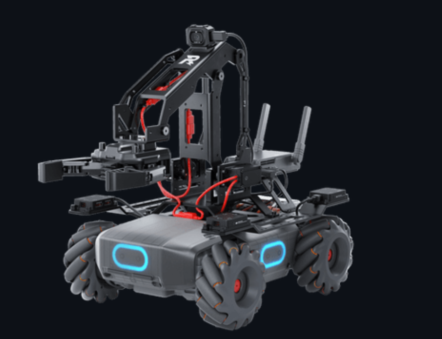
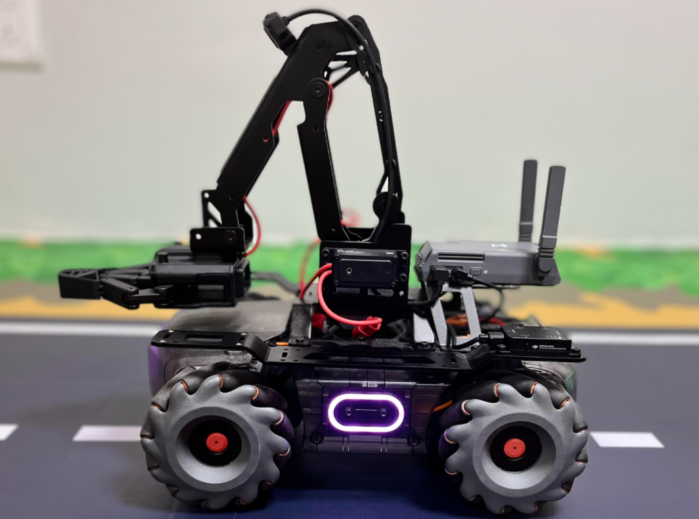
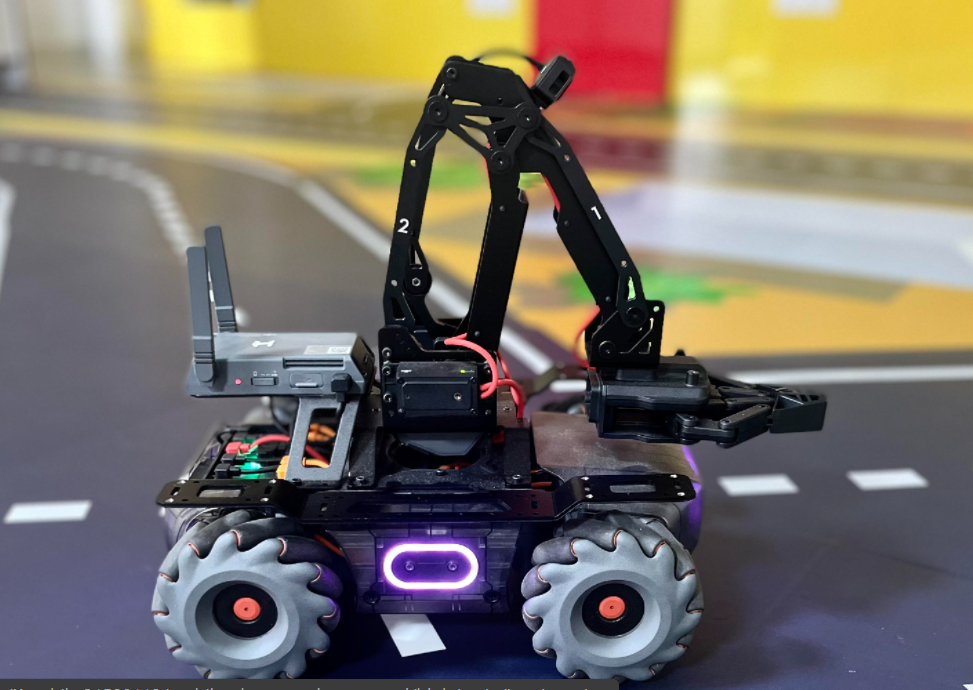

# MobileRobot-Openloopcontrol
## Aim:
To develop a python control code to move the mobilerobot along the predefined path.

## Equipments Required:
RoboMaster EP core
Python 3.7
## Procedure
### Step1:
Initiate the MobileRobot.

### Step2:
Connect your PC with the MobileRobot.

### Step3:
Open Python program.

### Step4:
Program the movements of the robot using python code.

### Step5:
Execute the python program.

## Program
#Python control code to move the mobilerobot along the predefined path.
#Developed by: LOGESHWARI.P
#Register No.: 21500746
from robomaster import robot
import time

if __name__ == '_main_':
    ep_robot = robot.Robot()
    ep_robot.initialize(conn_type="ap")

    ep_led = ep_robot.led

    for i in range(2):
        ep_led.set_led(comp="all",r=0,g=200,b=0,effect="on")   
        time.sleep(2)
        ep_led.set_led(comp="all",r=128,g=0,b=123,effect="on")   
        time.sleep(2)

    ep_chassis = ep_robot.chassis

    ep_chassis.move(x=2.5, y=0, z=0, xy_speed=0.75).wait_for_completed()

    ep_chassis.move(x=0, y=0, z=45, xy_speed=1).wait_for_completed()

    ep_chassis.move(x=1.5, y=-.3, z=0, xy_speed=0.75).wait_for_completed()

    ep_chassis.move(x=1.5, y=-.2, z=0, xy_speed=0.75).wait_for_completed()

    ep_chassis.move(x=0, y=0, z=10, xy_speed=0.75).wait_for_completed()

    ep_chassis.move(x=.2, y=0, z=20, xy_speed=0.75).wait_for_completed()

    ep_chassis.move(x=1, y=0, z=0, xy_speed=0.75).wait_for_completed()

    ep_chassis.move(x=0, y=0, z=40, xy_speed=0.75).wait_for_completed()

    ep_chassis.move(x=.5, y=0, z=0, xy_speed=0.75).wait_for_completed()

    ep_chassis.move(x=0, y=0, z=40, xy_speed=0.75).wait_for_completed()

    ep_chassis.move(x=0, y=.3, z=0, xy_speed=0.75).wait_for_completed()

    ep_chassis.move(x=1, y=0, z=0, xy_speed=0.75).wait_for_completed()

    ep_chassis.move(x=0, y=0, z=40, xy_speed=0.75).wait_for_completed()

    ep_chassis.move(x=1, y=0, z=0, xy_speed=0.75).wait_for_completed()

    ep_chassis.move(x=0, y=0, z=40, xy_speed=0.75).wait_for_completed()

    ep_chassis.move(x=1, y=0, z=0, xy_speed=0.75).wait_for_completed()

    ep_chassis.move(x=0, y=0, z=40, xy_speed=0.75).wait_for_completed()

    ep_chassis.move(x=1.5, y=0, z=0, xy_speed=0.75).wait_for_completed()

    ep_chassis.move(x=0, y=-.3, z=0, xy_speed=0.75).wait_for_completed()

    ep_chassis.move(x=0, y=0, z=30, xy_speed=0.75).wait_for_completed()

    ep_chassis.move(x=1, y=0, z=0, xy_speed=0.75).wait_for_completed()

    print("completed")


    ep_robot.close()

## MobileRobot Movement Image:



## Robot Start point:



## Robot End point:




## MobileRobot Movement Video:

Upload your video in Youtube and paste your video-id here

[](https://www.youtube.com/watch?v=kJGkk_tWQsQ)


## Result:
Thus the python program code is developed to move the mobilerobot in the predefined path.


```
Mobile Robotics Laboratory
Department of Artificial Intelligence and Data Science/ Machine Learning
Saveetha Engineering College
```
